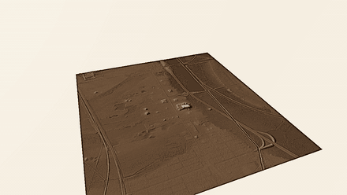
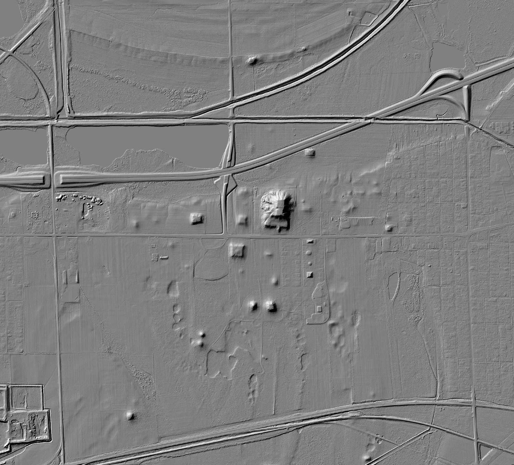

# Project Kiva

<p align="center">
  
</p>

<p align="center">
  <em>Reading the ground with lasers — American Southwest, and wherever else it works</em>
</p>

---

**Somewhere under a bare-earth point cloud is a wall nobody has stood next to
in a thousand years. This project goes and finds it — and, just as often,
finds out why it can't.**

No shovel, no dig permit, no helicopter. An aircraft flies a laser over the
ground, firing a few hundred thousand pulses a second, and times each bounce.
Time times the speed of light gives distance. Do that for hours and you have a
cloud of dots hanging in space, every one a place the beam hit something.

The trick that makes archaeology possible: a laser pulse is small enough to
slip between leaves. One pulse can clip a branch, then a lower branch, then
the dirt, and all of it gets recorded. Throw away everything except the last
returns and you have **the shape of the ground with the forest deleted**.

Named for the **kiva** — the sunken ceremonial chamber at the heart of
Ancestral Puebloan architecture, and exactly the sort of low, soft-edged
feature that a thousand years of wind tries to erase and a laser refuses to
forget.

---

## I. The reveal

Chaco Canyon's Pueblo Bonito is among the most excavated, most photographed
sites in North America — 700-plus rooms, the centre of the Chacoan world,
built 850-1150 CE. You should not be able to *discover* anything about it from
a laptop. And yet:


*The D-shaped arc of room blocks and the two great kivas in the plaza,
generated from raw LiDAR points downloaded the same day.*

What happened, in order:

1. **The finished product has a hole exactly where it matters.** USGS's 1-metre
   DEM has no coverage over the canyon core. The most important square
   kilometre in the park simply isn't in the polished dataset.
2. **The raw data does.** A newer gap-fill acquisition (`CO_CONMGaps_D24`) has
   a point cloud tile sitting right on the canyon that was never turned into a
   DEM. 55 MB, one `.laz`, 1 km square.
3. **Built the surface from scratch.** 14,792,731 points, 13,026,412 already
   classified as ground — 88%, dense and clean. Gridded to a 1 m bare-earth
   surface.
4. **Then made the faint things visible.** A two-foot wall is nothing beside a
   300-foot canyon; the big shape drowns the small one. So: blur the terrain
   heavily, subtract the blur from the sharp original. The landforms cancel.
   What survives is only fine relief — wall stubs, room depressions, midden
   mounds. That's a **Local Relief Model**, and it is the whole magic trick.
5. **Zoomed to the coordinates.** No enhancement, no guessing. The room-block
   arc and the kiva depressions fell straight out of a tight, zero-centred
   colour stretch.

To be clear about what this is: a **visual identification against a known,
extensively excavated site**. Not a new discovery, not automated detection.
It's here because turning raw laser returns into a recognisable floor plan on
the same day the cloud was downloaded is exactly what this project exists to do.

### The same canyon, in three dimensions


*Chaco Wash cuts the frame diagonally; the cliff line at left is the canyon's
south wall. Built from the project's own bare-earth DEM with
[forge3d](https://github.com/milos-agathon/forge3d), sun at 302°/24°. No
compositing, no hand-editing.*

---

## II. Does the trick travel?

A method you've used once is an anecdote. So: take it somewhere else.

USGS stops at the US border. For everywhere else there is **Copernicus
GLO-30**, a global 30 m model built from TanDEM-X radar, served as Cloud
Optimized GeoTIFFs from a public bucket. No account, no key:

```powershell
pixi run python scripts/fetch_global_dem.py --lat 29.9792 --lon 31.1342 --name giza
```

### Giza: it works


*Khufu, Khafre and Menkaure in their true diagonal alignment, three bright
blocks on the escarpment. The Nile floodplain is the darker ground upper left.
Terrain, lighting and shading are forge3d; the desert palette is a luminance
remap applied afterward.*

Copernicus is a **surface** model — it includes buildings, vegetation and
standing monuments. Usually that's a limitation. For monumental architecture
in a desert it's the entire point: the pyramids are *in* the elevation data.
No detection step required.

### Tikal: it fails, and that's the better story


*Same pipeline. Same Local Relief Model that resolved Pueblo Bonito's room
blocks. Here: nothing. No straight lines, no right angles, no repeating
structure — organic blobs.*

Those blobs are **treetops**. Tikal sits under 40+ m of rainforest, and radar
from orbit measures the top of it. The signal isn't entirely gone — sampling
the surface at Temple IV gives 317.6 m against 296.2 m at Temple I, a 21 m
difference in the right direction, since Temple IV really is taller and on
higher ground. But that faint signal is buried under canopy variation of the
same magnitude.

This is precisely why the landmark Maya LiDAR surveys used **airborne** laser
with ground-return classification instead of satellite radar. Laser pulses
find gaps in the canopy and reach the forest floor. Radar does not. Same
technique, same code, entirely different instrument requirement.

| Site | Source | Ground visible? | Result |
|---|---|---|---|
| Chaco Canyon | USGS airborne LiDAR (classified) | Yes — bare desert, ground returns | Room blocks and kivas resolved |
| Giza | Copernicus GLO-30 radar DSM | Yes — bare desert, no canopy | Pyramids resolved as surface relief |
| Tikal | Copernicus GLO-30 radar DSM | **No** — dense rainforest canopy | Canopy noise only |

---

## III. Closer to home

### Fly the fort — Fort Worden, Washington


*Ten seconds, one orbit, 241 frames. Artillery Hill at Fort Worden State Park,
Port Townsend — the zigzag notches are Battery Kinzie and its neighbours,
concrete emplacements built to close the entrance to Puget Sound. Bare-earth
lidar. No imagery, no 3D model. Just the ground.*

Source: **USGS 3DEP**, `WA_Olympic_Peninsula_C1_2017`, one 1-metre bare-earth
tile, 53 MB. Washington DNR's [lidar portal](https://lidarportal.dnr.wa.gov)
also covers this ground with eight overlapping projects, but 3DEP served the
same coverage as a single clean tile with one API call.

```powershell
pixi run python scripts/flythrough.py --dem data/processed/artillery_hill.tif
pixi run python scripts/postprocess_frames.py --palette steel
pixi run ffmpeg -y -framerate 24 -i data/renders/frames_final/frame_%04d.png `
    -c:v libx264 -pix_fmt yuv420p -crf 18 data/renders/flythrough.mp4
```

Three things that make or break a flythrough:

**The grade is not optional.** forge3d's terrain shading is driven by an
elevation colormap, not the sun vector — moving `set_sun` from 25° to 10°
barely changes the image, and raw frames come out washed-out green.
`postprocess_frames.py` does the real work: luminance, unsharp mask, palette.
That's what turns a pale mound into legible concrete.

**Grade with fixed bounds or the clip flickers.** The contrast stretch is
computed once across a sample and reused for all 241 frames. Normalise per
frame and the histogram breathes as the camera moves, which reads as a pulse.

**Crop before you fight the water.** Fort Worden is a peninsula; the first crop
was half Puget Sound, rendering as a flat plane. Masking sea level to NoData
did nothing — forge3d's terrain loader ignores the NoData flag. Re-cropping
onto the high ground took water from 50% of the frame to 20%.

### Cahokia — the largest earthwork in North America



*Monks Mound and the Mississippian city around it, across the Mississippi
from St. Louis. 100 ft tall, four terraces, a footprint about the size of the
Great Pyramid of Giza — and roughly 120 more mounds in the surrounding
2,000 acres. Occupied 800-1400 CE.*



*Bare earth at 1 m. Monks Mound is the terraced mass at centre, modern
staircase and all. The Grand Plaza is the flat ground south of it, dozens of
smaller mounds read as distinct bumps, and I-55/70 cuts across the top — a
1,200-year-old city and an interstate in the same frame.*

**The data lied about its own extent, again.** The newest lidar over Cahokia
(`IL_10CountyNRCS_D23`, 2023) advertises a bounding box covering the whole
site. It does not: valid data stops partway down, and the Grand Plaza, Twin
Mounds and Mound 72 all fall in nodata. Sampling three overlapping projects at
four known site locations sorted it out:

| Project | Monks Mound | Grand Plaza | Twin Mounds | Mound 72 |
|---|---|---|---|---|
| IL_10CountyNRCS_D23 (2023) | 145.3 m | nodata | nodata | nodata |
| IL_HicksDome_2019 | 145.5 m | 127.3 m | 127.6 m | 127.4 m |
| IL_MadisonCo_2014 | 145.5 m | 127.2 m | 127.6 m | 127.3 m |

Over the study window the newest project is 53% valid, HicksDome 63%, and
MadisonCo 2014 is **100%**. Older data won, because one consistent source
beats a mosaic with a seam running through the middle of the flythrough.

The DEM also confirmed itself: the highest point in the crop is 158.2 m and
sits **52 m from the published Monks Mound coordinate**. The mound found
itself.

```powershell
pixi run python scripts/flythrough.py --dem data/processed/cahokia_dtm_clean.tif `
    --z-scale 8 --radius-wide 4200 --radius-close 2300
pixi run python scripts/postprocess_frames.py --palette earth --gamma 0.42
```

Cahokia needed a new palette. `steel` suits concrete and `volcanic` suits
basalt; neither suits an earthwork on a floodplain, so `earth` (umber to
ochre to bone) joined the set. Its first grade came out muddy — most of a
floodplain sits at the low end of the ramp, where that palette is darkest,
and the smaller mounds vanished. Gamma 0.42 rather than the usual 0.85 is
what brings them back.

---

### Mount St. Helens — 485 MB you never download


*The 1980 blast amphitheatre opening north, lava dome on the crater floor,
erosion gullies radiating down every flank. Summit reads 2,535 m; the
pre-eruption cone was 2,950 m. The missing 400 m is the eruption.*

The source tile is **485 MB for one degree of Washington**, and this needed
11 km out of the middle of it. These are Cloud Optimized GeoTIFFs on S3, so
GDAL can range-request just the window — like reading one chapter instead of
buying the book:

```python
gdal.SetConfigOption("GDAL_DISABLE_READDIR_ON_OPEN", "EMPTY_DIR")
url = "/vsicurl/https://prd-tnm.s3.amazonaws.com/StagedProducts/Elevation/13/" \
      "TIFF/historical/n47w123/USGS_13_n47w123_20250813.tif"
gdal.Translate("st_helens.tif", gdal.Open(url),
               projWin=[-122.32, 46.30, -122.07, 46.10])
```

Twenty-two seconds, no download, no cleanup. Worth doing for any CONUS site.

The grade uses the `volcanic` palette against Fort Worden's `steel` — same
script, same flicker-free bounds, only the ramp and gamma change. Lifting
gamma from 0.85 to 0.55 is what recovers the flank drainages; at the default
they crush to black and the mountain reads as a silhouette with a bright ring.

### Fort Steilacoom — streaming raw points from a 350 TB archive

Everything above works from finished DEM rasters. The **point clouds** those
DEMs were built from are also public — 75 trillion points, ~350 TB — published
as Entwine Point Tiles in a no-auth bucket:

```
aws s3 ls --no-sign-request s3://usgs-lidar-public/
```

PDAL's `readers.ept` walks the octree and pulls only the nodes intersecting a
bounding box. Same range-request idea as a COG, applied to points instead of
pixels. You never download the project.

Every project publishes an `ept.json` with a point count and bounds, so density
is one division away — measured, not assumed:

| Project | Points | pts/m² |
|---|---|---|
| WA_FEMAHQ_B1_QL1_2018 | 653 M | **16.4** |
| WA_PierceCounty_1_2020 | 59.3 B | **12.0** |
| WA_NorthCentral_1_2021 | 102.7 B | 9.1 |
| WA_KingCo_1_2021 | 31.0 B | 8.3 |

3DEP's QL1 spec is 8 pts/m². Pierce County runs ~12 project-wide and 15+
locally — enough for a **0.5 m** grid, four times finer than the 1 m DEM
covering the same ground. And it covers Lakewood.


*Fort Steilacoom, Lakewood — grounds of the 1849 US Army post, later Western
State Hospital. 1.2 km square, 8.3 million ground returns, 0.5 m bare earth.
Black rectangles are buildings: structures are not ground, so a true
bare-earth model leaves voids where they stood. Waughop Lake bottom left. The
field boundaries, terracing and old track alignments crossing the open ground
do not survive at 1 m.*

```powershell
pixi run python scripts/fetch_pointcloud.py --name fort_steilacoom `
    --west -122.5680 --east -122.5520 --south 47.1720 --north 47.1830
```

One trap worth knowing: USGS EPT resources are stored in **EPSG:3857**, not
the survey CRS. Pass bounds in the wrong CRS and you get zero points back
with no error at all.

---

## IV. How the data lies to you

Every real finding in this repository came from checking something that
looked settled. The most instructive case is the one where the premise was
wrong.

### Five dates, two surfaces

The National Map lists **five published epochs** of the tile covering Mount
St. Helens — 2021-06, 2021-11, 2022-05, 2023-06, 2025-08. An active volcano
with a free time series looks like an obvious change-detection study.

It isn't. Over the crater, **four of those five files are pixel-identical.**

```
20211129 vs 20220505: IDENTICAL
20211129 vs 20230608: IDENTICAL
20211129 vs 20250813: IDENTICAL
20210615 vs 20211129: differs, max|d|=365.4 m
```

3DEP tiles are republished whenever *any* source project inside the 1-degree
tile is refreshed. Look at what actually triggered each release:

| Published | Triggering source project |
|---|---|
| 2021-06-15 | WA_PierceCounty_2020 |
| 2021-11-29 | WA_FEMAHQ_2018 |
| 2022-05-05 | WA_ThurstonCounty_2021 |
| 2023-06-08 | WA_Nisqually_TopoBathy_2020 |
| 2025-08-13 | WA_CentralWildfire_D22 |

Pierce, Thurston, Nisqually — not one of them is Mount St. Helens. Each
release refreshed a different corner of a 70-mile square and left the volcano
untouched. **The publication date describes the tile, not your pixels.**

The acquisition dates make it worse: ScienceBase gives the 2021-06 tile a
survey window of 2020-04 to 2020-06, and the *later* 2021-11 tile a window of
2018-08 to 2019-05. The newer publication carries the older survey.

### The one real difference, and how you know it's real


*Red is higher in the newer surface, blue lower. The crater floor rises by
hundreds of metres; a thin blue collar traces the rim; faint radial streaks
follow the flank gullies.*

One pair genuinely differs. So run the check that matters — **if the change is
real, stable ground far away should agree:**

| Ring from peak change | Median Δ | p95 abs Δ |
|---|---|---|
| 0-400 m | **+279.9 m** | 350.3 m |
| 800-1,200 m | -1.9 m | 74.5 m |
| 3,500-5,000 m | **-2.1 m** | 7.2 m |

Far-field terrain agrees to about **2 m** while the crater differs by **280 m**
— two orders of magnitude apart. Had the outer rings drifted with the centre,
this would be a co-registration or datum artefact and the whole thing noise.
They don't, so that crater fill is real ground.

A few hundred metres is the scale of the 2004-2008 dome-building episode. But
this is a difference between two *source vintages* and the metadata can date
neither over these pixels. The honest statement is **real change of unknown
epoch** — not a measurement of dome growth between two known dates.

```powershell
pixi run python scripts/epoch_check.py --tile n47w123 `
    --west -122.225 --east -122.165 --south 46.165 --north 46.215
```

`epoch_check.py` runs this for any 3DEP tile and window: lists the epochs and
what triggered them, reports which are pixel-identical, and runs the radial
stable-ground test on whichever pair actually differs. Run it **before**
building an analysis on "multi-temporal" 3DEP.

---

## The rules of the road

Collected from things that went wrong here, so they don't have to go wrong again:

* **The date on the file describes the file, not your pixels.** Check whether
  two epochs are actually different data before differencing them.
* **Stable ground is the control.** If far-field terrain disagrees as much as
  your target does, you're looking at a source artefact, not change.
* **Match the instrument to the ground.** Radar reads canopy; laser reads
  through it. No amount of processing fixes the wrong sensor.
* **The finished product may have a hole where the interesting thing is.** The
  raw data often doesn't.
* **Bounds go in the dataset's CRS, not yours.** EPT in EPSG:3857 returns zero
  points, silently, for a correct-looking query in the survey CRS.
* **Measure density, don't assume it.** `ept.json` gives points and bounds;
  the division takes a second and decides your achievable resolution.

Camera settings that work, for the next site: orbit with `phi/theta/radius`
and leave `target` alone — an explicit projected-coordinate target trips the
viewer's internal coordinate rebasing. Keep `z_scale` in the 2-3 range; larger
values inflate the vertical bounding box until auto-framing pushes the terrain
off-screen. Set `radius` to roughly 0.7-1.4× the tile width.

---

## Study Areas

| Site | State | Period | Key Features |
|------|-------|--------|-------------|
| **Chaco Canyon** | NM | 850-1150 CE | Great houses, road network, kivas |
| **Mesa Verde** | CO | 600-1300 CE | Cliff dwellings, mesa-top villages |
| **Hohokam Phoenix** | AZ | 300-1450 CE | Canal network, platform mounds |
| **Canyon de Chelly** | AZ | 2500 BCE-present | Cliff dwellings, petroglyphs |

Switch sites by changing `active_site` in `config.yaml`.

---

## Quickstart

```powershell
pixi install

# US sites: USGS 3DEP DEMs and point cloud tiles
pixi run python scripts/download_dem.py

# Everywhere else: Copernicus GLO-30
pixi run python scripts/fetch_global_dem.py --lat 29.9792 --lon 31.1342 --name giza

# Raw points -> bare-earth DEM -> Local Relief Model
pixi run python scripts/run_pipeline.py

# 3D render, and an orbiting flythrough
pixi run python scripts/render_site.py --dem data/processed/pueblo_bonito_dem_1m.tif
pixi run python scripts/flythrough.py --dem data/processed/artillery_hill.tif
pixi run python scripts/postprocess_frames.py --palette steel

pixi run notebooks
```

## Project Structure

```
project-kiva/
├── config.yaml                  ← switch sites here
├── pixi.toml                    ← environment
│
├── notebooks/
│   ├── 01_data_acquisition      Download USGS 3DEP tiles
│   ├── 02_render_forge3d        3D terrain renders
│   ├── 03_lidar_processing      Point cloud -> bare-earth DEM     (roadmap)
│   ├── 04_archaeological_viz    SVF, LRM, hillshade products      (roadmap)
│   └── 05_feature_detection     Automated mound/kiva detection    (roadmap)
│
├── scripts/
│   ├── download_dem.py          USGS 3DEP DEMs / LAZ tiles
│   ├── fetch_global_dem.py      Copernicus GLO-30, non-US sites
│   ├── fetch_pointcloud.py      Stream 3DEP points from AWS -> DTM + DSM
│   ├── epoch_check.py           Are two 3DEP "epochs" actually different data?
│   ├── run_pipeline.py          Ground points -> DEM -> Local Relief Model
│   ├── render_site.py           forge3d terrain renderer (stills)
│   ├── flythrough.py            Orbiting camera animation -> frames
│   └── postprocess_frames.py    Colour grade (fixed bounds, no flicker)
│
├── data/
│   ├── raw/          LAZ tiles (gitignored)
│   ├── processed/    GeoTIFFs and raster products (gitignored)
│   ├── renders/      Full-res outputs (gitignored)
│   ├── vectors/      GeoJSON site features (committed)
│   └── assets/       Project imagery
│
├── docs/images/      Compressed figures for this README (committed)
└── web/index.html    GitHub Pages interactive map
```

## Pipeline

```
USGS 3DEP (LAZ / GeoTIFF)  ·  Copernicus GLO-30 (COG)
    |
Ground classification -> bare-earth DEM
    |
+-------------------------------------------------------+
|  Archaeological visualisation                          |
|  * Local Relief Model      -- built                    |  <- wall stubs, mounds, plaza edges
|  * Multi-azimuth hillshade -- roadmap                  |
|  * Sky-View Factor         -- roadmap                  |  <- kiva depressions, road berms
+-------------------------------------------------------+
    |
Automated detection -> candidate_features.geojson        (roadmap)
    |
forge3d -> stills, orbiting flythroughs
    |
Leaflet web map -> GitHub Pages
```

## forge3d Rendering

Project Kiva uses [forge3d](https://github.com/milos-agathon/forge3d) for
GPU-accelerated terrain visualisation through its headless viewer — no Rust
toolchain or viewer binary required.

```python
import forge3d as f3d

with f3d.open_viewer_async(terrain_path=dem, width=1280, height=720) as v:
    v.set_z_scale(2.5)
    v.set_orbit_camera(phi_deg=225, theta_deg=45, radius=700, fov_deg=42)
    v.set_sun(azimuth_deg=302, elevation_deg=24)
    v.snapshot("render.png", width=1920, height=1080)
```

## Web Map

Live at **[bdgroves.github.io/project-kiva](https://bdgroves.github.io/project-kiva)**

- Satellite, topo and terrain basemaps
- Known great house and kiva locations with historical notes
- Automated candidate detections (roadmap)
- Schematic road and canal overlays

## Related

**[lidar-explore](https://github.com/bdgroves/lidar-explore)** — the same
discipline pointed at forestry instead of archaeology. Individual-tree
detection validated against 1,295 stands of Finland's national forest
inventory, a published null result on harvest ranking, terrain-based machine
planning, and a test of slope against Washington DNR's own unstable-slope
determinations across 1,024 harvest applications.

## References

- Lekson, S.H. (1999). *The Chaco Meridian.* AltaMira Press.
- Chase, A. et al. (2011). Airborne LiDAR, archaeology, and the ancient Maya landscape. *Journal of Archaeological Science*, 38(2).
- Evans, D. et al. (2013). Uncovering archaeological landscapes at Angkor using LiDAR. *PNAS*, 110(31).
- Opitz, R. & Cowley, D. (Eds.) (2013). *Interpreting Archaeological Topography.* Oxbow Books.

---

<p align="center">
  Code: MIT &nbsp;&middot;&nbsp; Data: USGS 3DEP public domain, Copernicus GLO-30 (ESA) &nbsp;&middot;&nbsp; Built in Tacoma, WA
</p>

<p align="center">
  <em>Visual identifications and feature detections here are exploratory outputs
  against known, documented sites — not verified excavation-grade findings.</em>
</p>
