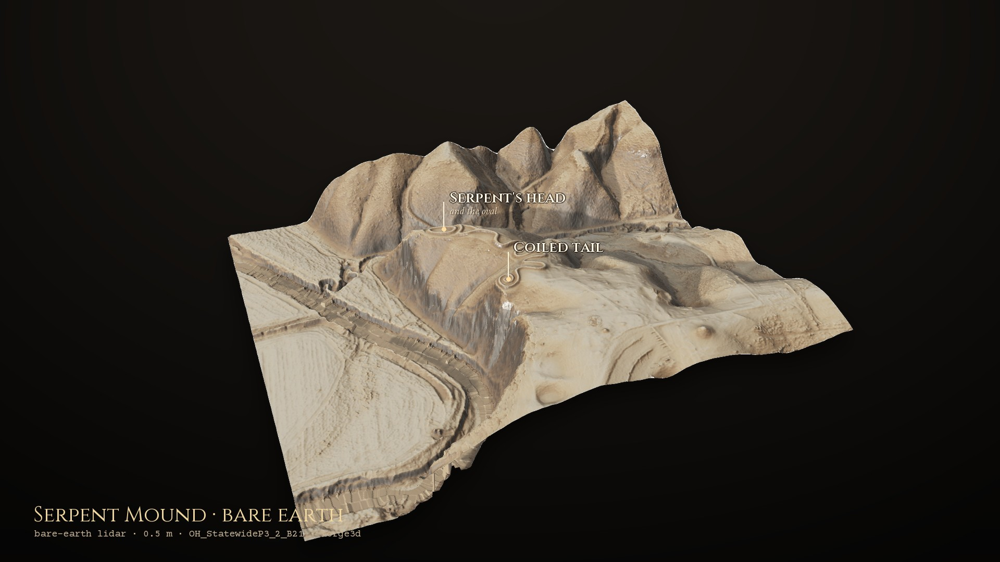
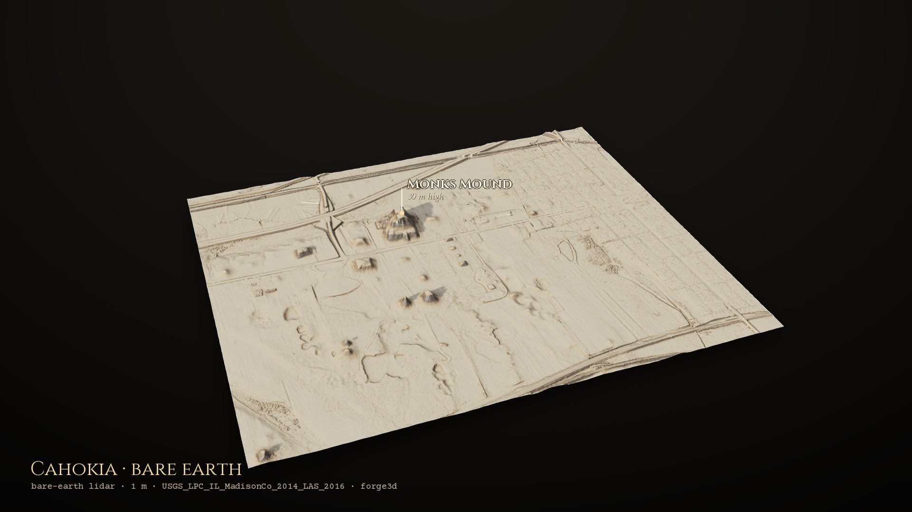
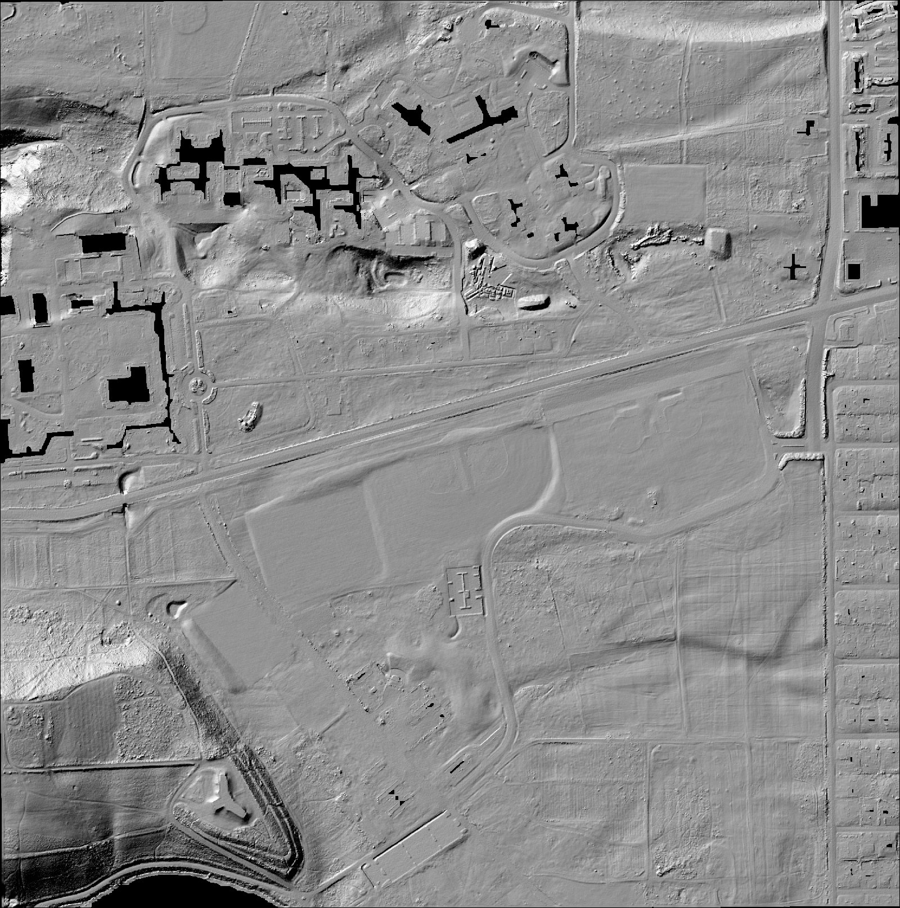
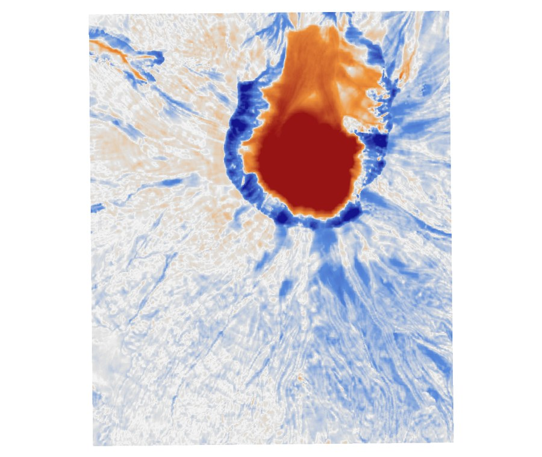

# Project Kiva

<p align="center">
  
</p>

<p align="center">
  <em>Reading the ground with lasers, from Chaco Canyon to Cahokia</em>
</p>

<p align="center">
  <strong><a href="https://brooksgroves.com/project-kiva/">brooksgroves.com/project-kiva</a></strong>: drag the line to peel the aerial photo back to the ground underneath.
</p>

---

**Somewhere under a bare-earth point cloud is a wall nobody has stood next to
in a thousand years. This project goes and finds it, and, just as often,
finds out why it can't.**

No shovel, no dig permit, no helicopter. An aircraft flies a laser over the
ground, firing a few hundred thousand pulses a second, and times each bounce.
Time times the speed of light gives distance. Do that for hours and you have a
cloud of dots hanging in space, every one a place the beam hit something.

The trick that makes archaeology possible: a laser pulse is small enough to
slip between leaves. One pulse can clip a branch, then a lower branch, then
the dirt, and all of it gets recorded. Throw away everything except the
returns classified as ground and you have **the shape of the ground with the
forest and the buildings deleted**.

Named for the **kiva**, the sunken ceremonial chamber at the heart of
Ancestral Puebloan architecture, and exactly the sort of low, soft-edged
feature that a thousand years of wind tries to erase and a laser refuses to
forget.

---

## The atlas



*Serpent Mound, Ohio: 2.3 million ground returns, gridded at half a metre and
draped with the relief composite, lit by forge3d from a low north-west sun.*

Twelve places, each a window of bare-earth lidar streamed from the USGS 3DEP
archive and run through the same pipeline. On the web page you drag a line
across the aerial photo to reveal the ground beneath it, switch between five
ways of looking at relief, and see the site turned in 3D.

| Site | Where | What the lidar shows |
|---|---|---|
| **Pueblo Bonito** | Chaco Canyon, NM | The great houses of the canyon floor, from a 2024 gap-fill tile |
| **Aztec Ruins** | Aztec, NM | West Ruin and its great kiva; East Ruin's rooms as rubble mounds |
| **Far View** | Mesa Verde, CO | Mesa-top pueblos, and Mummy Lake, a 27 m ring on a ridge |
| **Chimney Rock** | Pagosa Springs, CO | A great house on a knife-edge ridge beside two pinnacles |
| **Pueblo Grande** | Phoenix, AZ | A Hohokam platform mound and ball court, between freeways |
| **Cahokia** | Collinsville, IL | Monks Mound's terraces and the mounds of the city around it |
| **Serpent Mound** | Adams County, OH | Every coil of a 411 m effigy, a metre high |
| **Newark Earthworks** | Newark, OH | The Octagon and the Great Circle, 2,000-year-old geometry |
| **Poverty Point** | West Carroll Parish, LA | Six concentric ridges, Mound A and Mound B |
| **Fort Steilacoom** | Lakewood, WA | Field boundaries and tracks of the 1849 Army post |
| **Devil's Lake Birdman** | Baraboo, WI | A winged effigy mound under the trees of the south shore |
| **Heim Fox Mound** | Middleton, WI | A fox effigy surviving between the houses |

Every pin on the map was checked against the lidar itself, not just copied
from a gazetteer (see *Checking the pins*, below).

---

## I. The reveal

Chaco Canyon's Pueblo Bonito is among the most excavated, most photographed
sites in North America: 700-plus rooms, the centre of the Chacoan world,
built 850–1150 CE. You should not be able to *discover* anything about it from
a laptop. And yet:


*The D-shaped arc of room blocks and the two great kivas in the plaza,
generated from raw lidar points downloaded the same day.*

What happened, in order:

1. **The finished product has a hole exactly where it matters.** USGS's 1 m
   DEM has no coverage over the canyon core. The most important square
   kilometre in the park simply isn't in the polished dataset.
2. **The raw data does.** A newer gap-fill acquisition (`CONMGaps_D24`) has
   a point-cloud tile sitting right on the canyon that was never turned into a
   DEM. 55 MB, one `.laz`, 1 km square.
3. **Built the surface from scratch.** 14,792,731 points, 13,026,412 already
   classified as ground: 88%, dense and clean. Gridded to a bare-earth surface.
4. **Then made the faint things visible.** A two-foot wall is nothing beside a
   300-foot canyon; the big shape drowns the small one. So: blur the terrain
   heavily, subtract the blur from the sharp original. The landforms cancel.
   What survives is only fine relief: wall stubs, room depressions, midden
   mounds. That's a **Local Relief Model**, and it is the whole magic trick.
5. **Zoomed to the coordinates.** No enhancement, no guessing. The room-block
   arc and the kiva depressions fell straight out of a tight, zero-centred
   colour stretch.

To be clear about what this is: a **visual identification against a known,
extensively excavated site**. Not a new discovery, not automated detection.
It's here because turning raw laser returns into a recognisable floor plan on
the same day the cloud was downloaded is exactly what this project exists to do.

In v2 the whole sequence is one command, `pixi run kiva build pueblo-bonito`:
it asks The National Map which point-cloud tiles cover the window, takes the
gap-fill project first and fills any edges from the next-best survey.

---

## II. Does the trick travel?

A method you've used once is an anecdote. So: take it somewhere else.

USGS stops at the US border. For everywhere else there is **Copernicus
GLO-30**, a global 30 m model built from TanDEM-X radar, served as Cloud
Optimized GeoTIFFs from a public bucket. No account, no key:

```powershell
pixi run global --lat 29.9792 --lon 31.1342 --name giza
```

### Giza: it works


*Khufu, Khafre and Menkaure in their true diagonal alignment, three bright
blocks on the escarpment. The Nile floodplain is the darker ground upper left.*

Copernicus is a **surface** model: it includes buildings, vegetation and
standing monuments. Usually that's a limitation. For monumental architecture
in a desert it's the entire point: the pyramids are *in* the elevation data.
No detection step required.

### Tikal: it fails, and that's the better story


*Same Local Relief Model that resolved Pueblo Bonito's room blocks. Here:
nothing. No straight lines, no right angles, no repeating structure, just
organic blobs.*

Those blobs are **treetops**. Tikal sits under 40+ m of rainforest, and radar
from orbit measures the top of it. The signal isn't entirely gone: sampling
the surface at Temple IV gives 317.6 m against 296.2 m at Temple I, a 21 m
difference in the right direction, since Temple IV really is taller and on
higher ground. But that faint signal is buried under canopy variation of the
same magnitude.

This is precisely why the landmark Maya lidar surveys used **airborne** laser
with ground-return classification instead of satellite radar. Laser pulses
find gaps in the canopy and reach the forest floor. Radar does not. Same
technique, same code, entirely different instrument requirement.

| Site | Source | Ground visible? | Result |
|---|---|---|---|
| Chaco Canyon | USGS airborne lidar (classified) | Yes: bare desert, ground returns | Room blocks and kivas resolved |
| Giza | Copernicus GLO-30 radar DSM | Yes: bare desert, no canopy | Pyramids resolved as surface relief |
| Tikal | Copernicus GLO-30 radar DSM | **No**: dense rainforest canopy | Canopy noise only |

---

## III. Closer to home

### Cahokia: the mound found itself, twice



*Monks Mound and the Mississippian city around it, across the Mississippi
from St. Louis. Monks Mound is about 30 m tall with four terraces, and roughly
120 more mounds were built in the surrounding 2,000 acres. The city peaked
around 1050–1350 CE.*

**The data lied about its own extent.** The newest lidar over Cahokia
(`IL_10CountyNRCS_D23`, 2023) advertises a bounding box covering the whole
site. It does not: valid data stops partway down, and the Grand Plaza, Twin
Mounds and Mound 72 all fall in nodata. Sampling three overlapping projects at
four known site locations sorted it out:

| Project | Monks Mound | Grand Plaza | Twin Mounds | Mound 72 |
|---|---|---|---|---|
| IL_10CountyNRCS_D23 (2023) | 145.3 m | nodata | nodata | nodata |
| IL_HicksDome_2019 | 145.5 m | 127.3 m | 127.6 m | 127.4 m |
| IL_MadisonCo_2014 | 145.5 m | 127.2 m | 127.6 m | 127.3 m |

Over the study window the newest project is 53% valid, HicksDome 63%, and
MadisonCo 2014 is **100%**. Older data won, because one consistent source
beats a mosaic with a seam running through the middle of the site. The atlas
uses MadisonCo 2014 too.

The DEM also confirmed itself. In v1 the highest point in the crop was
158.2 m and sat 52 m from the published Monks Mound coordinate. In v2 the
build records the highest points in every window, and Cahokia's top again
comes out at **158.2 m on Monks Mound**, now from points streamed straight out
of the cloud archive rather than a downloaded DEM.

### Fort Steilacoom: streaming raw points from a 350 TB archive

The point clouds behind the USGS elevation models are public: 75 trillion
points, about 350 TB, published as Entwine Point Tiles in a no-auth bucket:

```
aws s3 ls --no-sign-request s3://usgs-lidar-public/
```

PDAL's `readers.ept` walks the octree and pulls only the nodes intersecting a
bounding box. Same range-request idea as a COG, applied to points instead of
pixels. You never download the project. This is now how eleven of the twelve atlas
sites are built.

Every project publishes an `ept.json` with a point count and bounds, so density
is one division away, measured, not assumed:

| Project | Points | pts/m² |
|---|---|---|
| WA_FEMAHQ_B1_QL1_2018 | 653 M | **16.4** |
| WA_PierceCounty_1_2020 | 59.3 B | **12.0** |
| WA_NorthCentral_1_2021 | 102.7 B | 9.1 |
| WA_KingCo_1_2021 | 31.0 B | 8.3 |

3DEP's QL1 spec is 8 pts/m². Pierce County runs about 12 project-wide and 15+
locally: enough for a **0.5 m** grid, four times finer than the 1 m DEM
covering the same ground. And it covers Lakewood.



*Fort Steilacoom, Lakewood: grounds of the 1849 US Army post, later Western
State Hospital. Black rectangles are buildings: structures are not ground, so
a true bare-earth model leaves voids where they stood. The field boundaries,
terracing and old track alignments crossing the open ground do not survive
at 1 m.*

One trap worth knowing: USGS EPT resources are stored in **EPSG:3857**, not
the survey CRS. Pass bounds in the wrong CRS and you get zero points back
with no error at all.

### Fort Worden and Mount St. Helens: the v1 flights


*Artillery Hill at Fort Worden State Park, Port Townsend: the zigzag notches
are Battery Kinzie and its neighbours, built to close the entrance to Puget
Sound. From the 1 m 3DEP DEM (`WA_Olympic_Peninsula_C1_2017`).*

Fort Worden isn't in the atlas: the only survey in the point-cloud archive
there (2016) reaches about a third of the window. The DEM above was built from
a different survey that never went into the archive.


*The 1980 blast amphitheatre opening north, lava dome on the crater floor.
Summit reads 2,535 m; the pre-eruption cone was 2,950 m. The missing 400 m is
the eruption.*

The source tile is **485 MB for one degree of Washington**, and this needed
11 km out of the middle of it. These are Cloud Optimized GeoTIFFs on S3, so
GDAL can range-request just the window, like reading one chapter instead of
buying the book:

```python
gdal.SetConfigOption("GDAL_DISABLE_READDIR_ON_OPEN", "EMPTY_DIR")
url = "/vsicurl/https://prd-tnm.s3.amazonaws.com/StagedProducts/Elevation/13/" \
      "TIFF/historical/n47w123/USGS_13_n47w123_20250813.tif"
gdal.Translate("st_helens.tif", gdal.Open(url),
               projWin=[-122.32, 46.30, -122.07, 46.10])
```

Twenty-two seconds, no download, no cleanup.

---

## IV. How the data lies to you

Every real finding in this repository came from checking something that
looked settled. The most instructive case is the one where the premise was
wrong.

### Five dates, two surfaces

The National Map lists **five published epochs** of the tile covering Mount
St. Helens: 2021-06, 2021-11, 2022-05, 2023-06, 2025-08. An active volcano
with a free time series looks like an obvious change-detection study.

It isn't. Over the crater, **four of those five files are pixel-identical.**

```
20211129 vs 20220505: IDENTICAL
20211129 vs 20230608: IDENTICAL
20211129 vs 20250813: IDENTICAL
20210615 vs 20211129: differs, max|d|=365.4 m
```

3DEP tiles are republished whenever *any* source project inside the 1-degree
tile is refreshed. Look at what actually triggered each release:

| Published | Triggering source project |
|---|---|
| 2021-06-15 | WA_PierceCounty_2020 |
| 2021-11-29 | WA_FEMAHQ_2018 |
| 2022-05-05 | WA_ThurstonCounty_2021 |
| 2023-06-08 | WA_Nisqually_TopoBathy_2020 |
| 2025-08-13 | WA_CentralWildfire_D22 |

Pierce, Thurston, Nisqually: not one of them is Mount St. Helens. Each
release refreshed a different corner of a 70-mile square and left the volcano
untouched. **The publication date describes the tile, not your pixels.**

The acquisition dates make it worse: ScienceBase gives the 2021-06 tile a
survey window of 2020-04 to 2020-06, and the *later* 2021-11 tile a window of
2018-08 to 2019-05. The newer publication carries the older survey.

### The one real difference, and how you know it's real



*Red is higher in the newer surface, blue lower. The crater floor rises by
hundreds of metres; a thin blue collar traces the rim.*

One pair genuinely differs. So run the check that matters: **if the change is
real, stable ground far away should agree.**

| Ring from peak change | Median Δ | p95 abs Δ |
|---|---|---|
| 0–400 m | **+279.9 m** | 350.3 m |
| 800–1,200 m | -1.9 m | 74.5 m |
| 3,500–5,000 m | **-2.1 m** | 7.2 m |

Far-field terrain agrees to about **2 m** while the crater differs by **280 m**,
two orders of magnitude apart. Had the outer rings drifted with the centre,
this would be a co-registration or datum artefact and the whole thing noise.
They don't, so that crater fill is real ground.

A few hundred metres is the scale of the 2004–2008 dome-building episode. But
this is a difference between two *source vintages* and the metadata can date
neither over these pixels. The honest statement is **real change of unknown
epoch**, not a measurement of dome growth between two known dates.

```powershell
pixi run epoch --tile n47w123 --west -122.225 --east -122.165 --south 46.165 --north 46.215
```

`scripts/epoch_check.py` runs this for any 3DEP tile and window: lists the
epochs and what triggered them, reports which are pixel-identical, and runs
the radial stable-ground test on whichever pair actually differs. Run it
**before** building an analysis on "multi-temporal" 3DEP.

---

## How it works

```
sites.yaml (window, survey, grid, pins)
    │
    ▼  kiva build
points ─► ground returns (class 2) ─► IDW grid ─► bare-earth DTM
          (EPT stream, or TNM tiles)               (blank where no ground was seen)
    │
    ▼  kiva/relief.py
hillshade · 16-sun hillshade · slope · local relief · sky-view · openness
    │                                    └─ blended into the composite
    ├─► web layers: Web Mercator WebP, transparent where there's no data
    │
    ▼  kiva photo / stills / orbit / encode
NAIP photo ─┐
composite  ─┴─► forge3d: the block, draped and lit ─► stills + orbit video
```

### The relief views

Ordinary shading is dominated by the big landforms. Each view strips the big
shape away in a different way.

| View | What it does | Reference |
|---|---|---|
| **Local relief** | The DTM minus a Gaussian-smoothed copy of itself (σ = 7.5 m). Bumps smaller than about 15 m survive. | after Hesse (2010) |
| **Sky-view factor** | How much of the sky each cell can see, scanning 16 directions out to 10 m. Pits and ditches see less. | Zakšek et al. (2011) |
| **Openness** | The same horizon scan read as angles; negative openness makes hollows glow. | Yokoyama et al. (2002) |
| **16-sun hillshade** | Lit from 16 directions and averaged, so no feature hides in its own shadow. | |
| **Composite** | Hillshade, slope, positive openness and sky-view blended with the VAT recipe. | Kokalj & Somrak (2019) |

`tests/test_relief.py` checks them against synthetic ground: a 1 m deep pit
must come out negative in local relief and darker in sky view, a 60 cm wall
positive, and a plane rising to the east must face a western sun.

### The 3D blocks (forge3d)

`kiva/render.py` drives forge3d 1.40.1's terrain viewer headless: Mesa's
llvmpipe Vulkan driver under Xvfb, so it runs on GitHub's CPUs with no GPU.
The DTM is the mesh, the relief composite (or the NAIP photograph) is draped
over it as a texture, and the viewer lights it with PBR shading, shadows and
ambient occlusion from a low north-west sun, the raking light archaeologists
wait for. The block is cut out of the frame and set on a dark backdrop like a
specimen.

What I learned since the v1 flights, which changes some of v1's advice:

* **The sun matters once PBR is on.** v1 found that moving the sun barely
  changed anything and that colour grading did all the work. That was the
  viewer's default shading. With `set_terrain_pbr` (shadows, height AO, soft
  sun visibility) and `set_terrain_sun`, the light does the work.
* **You can aim the camera.** `set_terrain_camera` takes an absolute target in
  viewer world coordinates: x = easting, y = (elevation − DEM minimum) ×
  zscale, z = −northing. Pins and the block's silhouette are projected with
  the same maths, so labels land on the ground.
* **The viewer won't look flatter than 5° below horizontal.** It raises the
  camera instead.
* **The mesh is at most 2048 vertices across.** The render DEM is resampled
  to fit and smoothed very lightly so cliffs don't stair-step.
* **Draping is the trick.** Any image can be an overlay with `load_overlay`;
  the relief composite tinted earth-brown reads as ground, not as a printout.

### Checking the pins

Each pin in `sites.yaml` was placed by finding the feature in the relief
views, not by trusting a coordinate list, and cross-checked where a published
figure exists:

* **Monks Mound** sits on the top terrace, and the window's highest point
  (158.2 m) is on it.
* **Mummy Lake** at Mesa Verde comes out within a few metres of the published
  coordinate (37.2406, −108.5048).
* **Poverty Point's Mound A and Mound B** come out 611 m apart; the published
  figure is 625 m (2,050 ft).
* **Serpent Mound's** head and coiled tail are read straight off the 0.5 m
  composite.

`site.json` for every site records the three highest points in the window, a
cheap way to catch a pin that has wandered.

---

## The rules of the road

Collected from things that went wrong here, so they don't have to go wrong again:

* **The date on the file describes the file, not your pixels.** Check whether
  two epochs are actually different data before differencing them.
* **Stable ground is the control.** If far-field terrain disagrees as much as
  your target does, you're looking at a source artefact, not change.
* **Match the instrument to the ground.** Radar reads canopy; laser reads
  through it. No amount of processing fixes the wrong sensor.
* **The finished product may have a hole where the interesting thing is.** The
  raw data often doesn't.
* **Bounds go in the dataset's CRS, not yours.** EPT in EPSG:3857 returns zero
  points, silently, for a correct-looking query in the survey CRS.
* **Measure density, don't assume it.** `ept.json` gives points and bounds;
  the division takes a second and decides your achievable resolution.
* **Don't trust a gazetteer coordinate.** Several of v1's map pins were
  hundreds of metres to kilometres off. Find the feature in the data.
* **A bump is a question, not a find.** Relief views show shape, not age.

---

## The notebook

**[notebooks/kiva.ipynb](notebooks/kiva.ipynb)** walks one site from laser points to the forge3d block with the same `kiva/` code: the window and the EPSG:3857 trap, streaming ground returns into a bare-earth DTM, all six relief views side by side, a transect showing why the local relief model makes a metre-high mound stand out, the pin check, NAIP, and the block from four sides. It's committed with its outputs (Serpent Mound), so it reads on GitHub without running anything.

`pixi run -e notebook notebooks` opens it in Jupyter Lab. Or run **Actions → Run notebooks** with any site id: Serpent Mound updates `notebooks/kiva.ipynb`, and any other site is saved as `notebooks/kiva-<site>.ipynb`.

## Run it

```powershell
pixi install
pixi run sites                       # the catalog
pixi run kiva build cahokia          # points -> DTM -> relief -> web layers
pixi run kiva photo cahokia          # NAIP for the comparison render
pixi run kiva stills cahokia         # forge3d stills (needs a GPU, or Mesa + Xvfb)
pixi run kiva orbit cahokia          # orbit frames
pixi run kiva encode cahokia         # -> sites/cahokia/orbit.mp4
pixi run kiva index                  # sites.json for the atlas
pixi run serve                       # http://localhost:8000
pixi run test
```

Or run **Actions → Build sites** to build any or all of them on GitHub, which
commits the results to `sites/`; **Publish sites** collects a finished run.
Add a site by giving it a window in `sites.yaml`; the
[3DEP boundaries file](https://github.com/hobuinc/usgs-lidar/blob/master/boundaries/resources.geojson)
says which survey covers it.

## Project structure

```
project-kiva/
├── index.html            the atlas (served by GitHub Pages)
├── sites.yaml            the site catalog
├── sites.json            built sites, for the atlas
├── sites/<id>/           web layers, site.json, stills, orbit video (committed)
├── kiva/
│   ├── cli.py            pixi run kiva ...
│   ├── fetch.py          EPT streaming and TNM tiles -> bare-earth DTM (PDAL)
│   ├── relief.py         the relief views
│   ├── web.py            web layers
│   ├── imagery.py        NAIP from the Planetary Computer
│   ├── render.py         forge3d blocks
│   └── fonts/            Cinzel, Crimson Text, Courier Prime (OFL)
├── scripts/
│   ├── epoch_check.py    are two 3DEP "epochs" actually different data?
│   ├── fetch_global_dem.py  Copernicus GLO-30 for sites outside the US
│   ├── publish_sites.sh  commit built sites (used by the workflows)
│   └── site_index.py
├── tests/                relief maths on synthetic ground
├── docs/images/          figures for this README
├── data/sites/           working files: DTMs, products, frames (gitignored)
└── .github/workflows/    Build sites, Publish sites
```

## Related

**[lidar-explore](https://github.com/bdgroves/lidar-explore)**: the same
discipline pointed at forestry instead of archaeology. **[SOLSTICE](https://brooksgroves.com/solstice/)**:
the sky over Chaco Canyon, computed against the real skyline, with a forge3d
flight down the canyon.

## References

- Hesse, R. (2010). LiDAR-derived Local Relief Models: a new tool for archaeological prospection. *Archaeological Prospection*, 17(2).
- Zakšek, K., Oštir, K. & Kokalj, Ž. (2011). Sky-View Factor as a relief visualization technique. *Remote Sensing*, 3(2).
- Yokoyama, R., Shirasawa, M. & Pike, R. J. (2002). Visualizing topography by openness. *Photogrammetric Engineering & Remote Sensing*, 68(3).
- Kokalj, Ž. & Somrak, M. (2019). Why not a single image? Combining visualizations to facilitate fieldwork and on-screen mapping. *Remote Sensing*, 11(7).
- Chase, A. et al. (2011). Airborne LiDAR, archaeology, and the ancient Maya landscape. *Journal of Archaeological Science*, 38(2).
- Evans, D. et al. (2013). Uncovering archaeological landscapes at Angkor using lidar. *PNAS*, 110(31).
- Opitz, R. & Cowley, D. (Eds.) (2013). *Interpreting Archaeological Topography.* Oxbow Books.
- Data: [USGS 3DEP](https://www.usgs.gov/3d-elevation-program) point clouds via the [AWS open data archive](https://registry.opendata.aws/usgs-lidar/) and [The National Map](https://apps.nationalmap.gov/); USDA NAIP via [Microsoft Planetary Computer](https://planetarycomputer.microsoft.com/dataset/naip); Copernicus GLO-30 (ESA).
- Software: [forge3d](https://github.com/milos-agathon/forge3d) by Milos Popovic, [PDAL](https://pdal.io), [rasterio](https://rasterio.readthedocs.io), [Leaflet](https://leafletjs.com).

---

<p align="center">
  Code: MIT &nbsp;&middot;&nbsp; Data: USGS 3DEP and USDA NAIP, public domain; Copernicus GLO-30 (ESA) &nbsp;&middot;&nbsp; Built in Lakewood, WA
</p>

<p align="center">
  <em>Pins and identifications here are against known, documented sites. They
  are exploratory outputs, not excavation-grade findings. Several of these
  places are sacred to living Native nations; please visit them with respect.</em>
</p>
