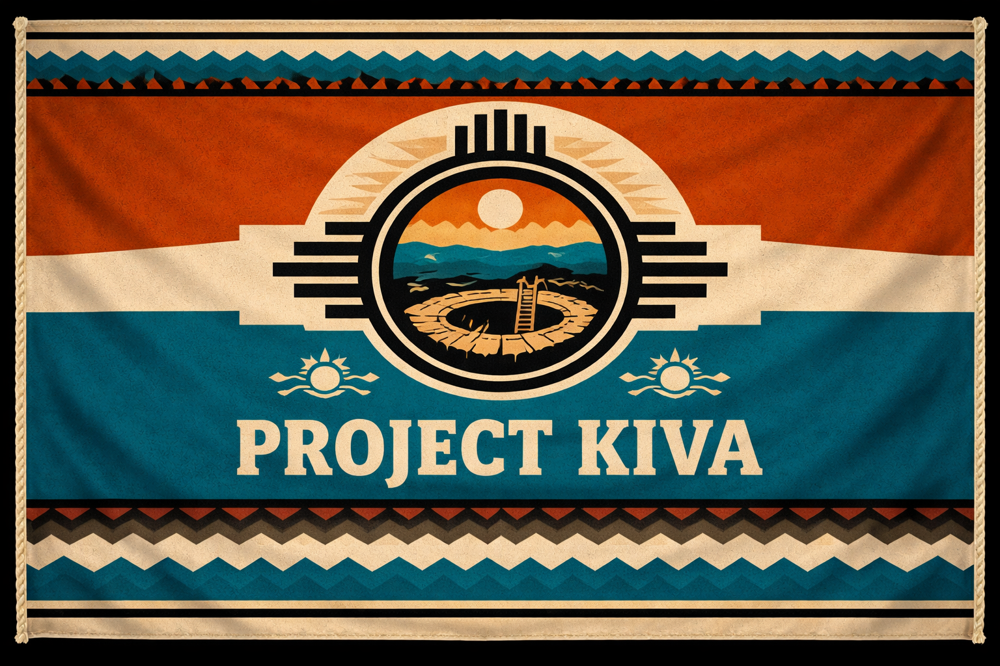
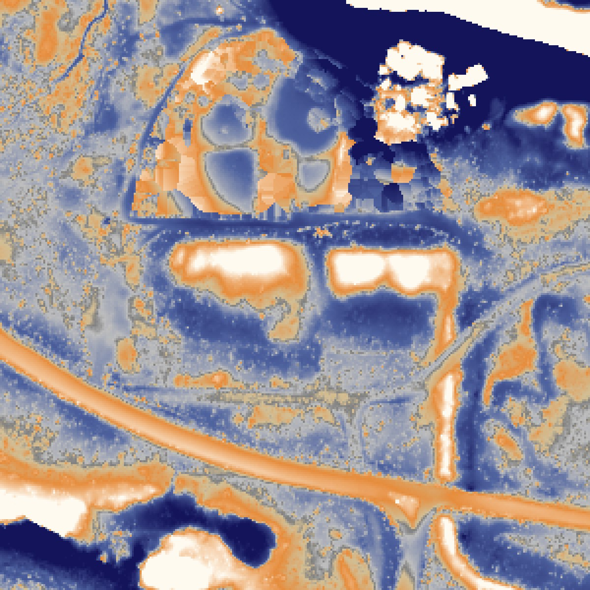
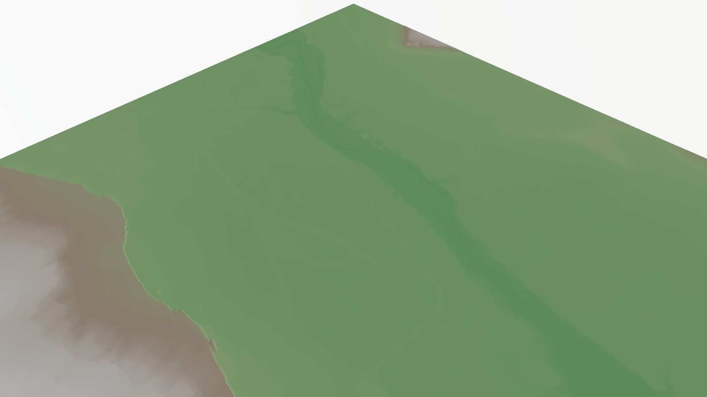
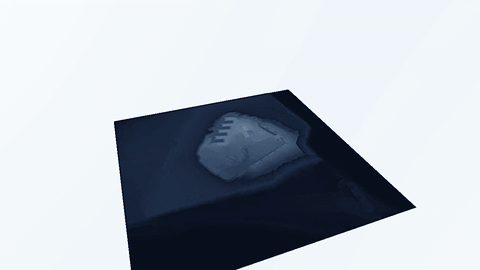
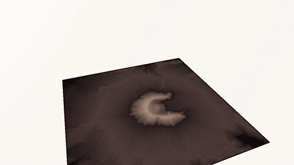
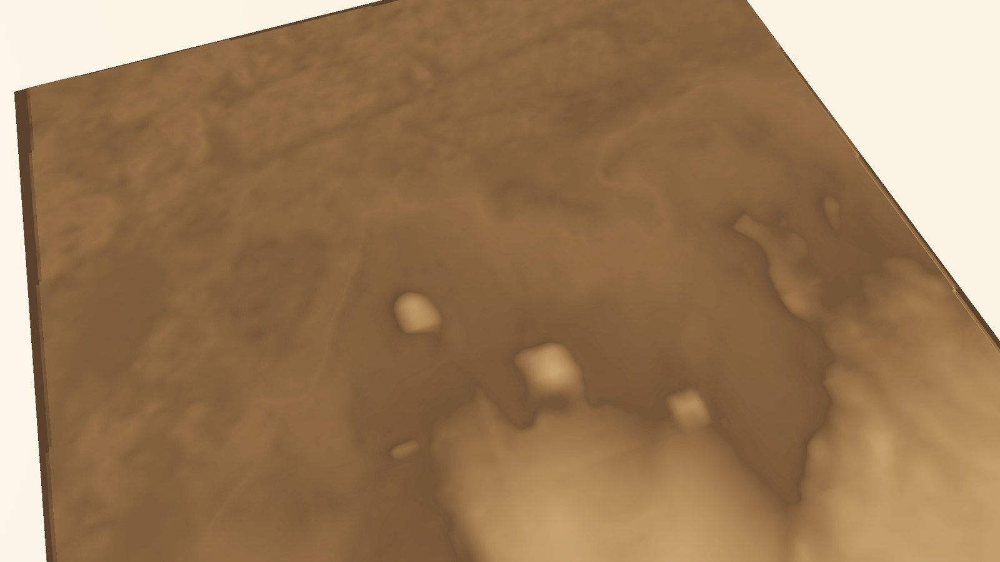
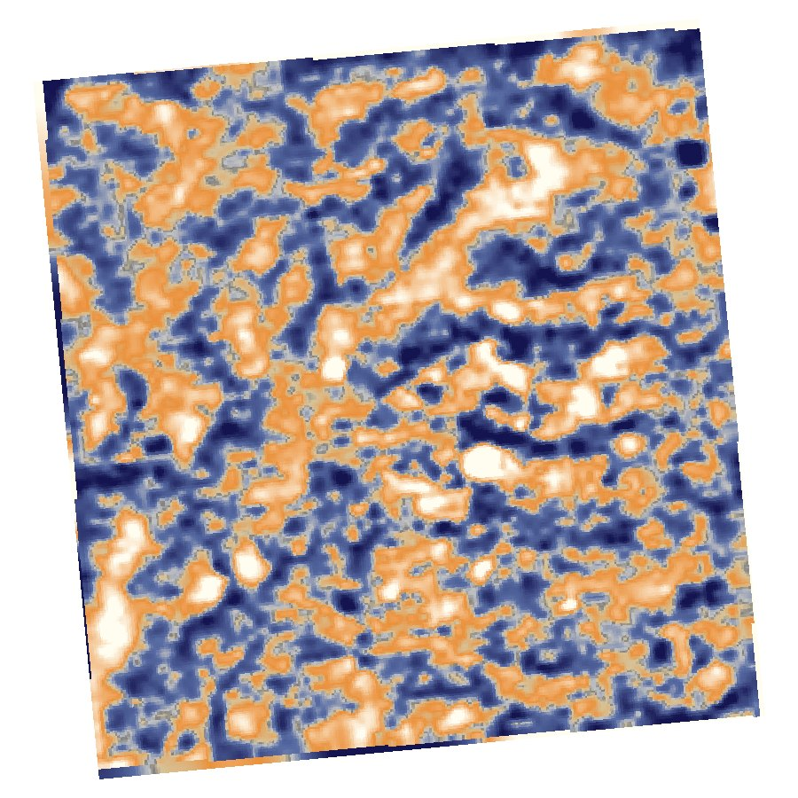

# Project Kiva

<p align="center">
  
</p>

<p align="center">
  <em>Archaeological LiDAR Survey — American Southwest</em>
</p>

---

**Somewhere under a bare-earth point cloud is a wall nobody has stood next to
in a thousand years. This project goes and finds it.**

No shovel, no dig permit, no helicopter — just publicly available airborne
LiDAR, a laptop, and the same technique that found lost cities under the
Guatemalan canopy and revealed the true scale of Angkor. Point a scanner at
the desert, strip away everything but the bare ground, and the earth itself
starts telling you where people built things.

Named for the **kiva** — the subterranean ceremonial chamber at the heart of
Ancestral Puebloan architecture, and precisely the kind of subtle,
low-relief feature that a LiDAR survey pulls out of the ground after a
thousand years of wind have tried to erase it.

---

## First find: Pueblo Bonito, reveal in hand

Chaco Canyon's Pueblo Bonito is one of the most excavated, most photographed
archaeological sites in North America — over 700 rooms, the center of the
Chacoan world, construction spanning 850-1150 CE. It should not be possible
to "discover" anything about it from a laptop. And yet:


*Local Relief Model, Pueblo Bonito, generated from raw LiDAR points
downloaded the same day this image was made. The D-shaped arc of room-block
cells and what are almost certainly the two great kivas in the plaza are
visible without ever opening a photograph of the site.*

Here's what actually happened, in order:

1. **The standard 1-meter DEM product has a hole exactly where Pueblo
   Bonito sits.** Queried USGS's National Map API for 1m elevation data
   over the canyon core — zero results. The finished product simply
   doesn't cover the most important square kilometer in the park.
2. **The raw LiDAR does.** A newer USGS gap-fill acquisition
   (`CO_CONMGaps_D24`, published 2026) has a point cloud tile sitting
   directly over the canyon core that never got turned into a DEM. Found
   it, downloaded it: 55 MB, one `.laz` tile, 1 km x 1 km.
3. **Built the DEM from scratch.** 14,792,731 points in the tile, 13,026,412
   of them already ground-classified (88%) — dense, clean survey data.
   Gridded the ground returns to a 1-meter bare-earth surface.
4. **Local Relief Model.** The canyon's broad slope and the coarse trend
   both drown out sub-meter archaeology, so the DEM gets differenced
   against a heavily smoothed version of itself (15 m Gaussian). What's
   left is stripped of topography and keeps only the fine relief — wall
   stubs, room depressions, midden mounds.
5. **Zoomed to the coordinates and there it was.** No enhancement, no
   guessing — the room-block arc and kiva depressions came straight out of
   a tight, zero-centered color stretch on the raw computation.

This is a **visual identification against a known, extensively excavated
site**, not a new archaeological discovery and not an automated detection —
see `feature_detection` in the roadmap below for where that's headed. It's
here because turning raw laser returns into a floor plan you can recognize,
on the same day the point cloud was downloaded, is exactly the kind of
result this project exists to produce.

---

## The canyon in three dimensions


*The same square kilometer, rendered as terrain. Chaco Wash cuts the frame
diagonally; the cliff line at left is the canyon's south wall. Built from the
project's own bare-earth DEM with [forge3d](https://github.com/milos-agathon/forge3d),
sun at 302 deg azimuth / 24 deg elevation — no compositing, no hand-editing.*

```powershell
pixi run python scripts/render_site.py --dem data/processed/pueblo_bonito_dem_1m.tif
```

---

## Fly the fort: Fort Worden, Washington



*Ten seconds, one orbit, 241 frames. Artillery Hill at Fort Worden State Park
in Port Townsend — the zigzag notches on the right are Battery Kinzie and its
neighbours, concrete gun emplacements built to close the entrance to Puget
Sound. Bare-earth lidar, no imagery, no 3D model. Just the ground.*

Source: **USGS 3DEP**, `WA_Olympic_Peninsula_C1_2017`, one 1-metre bare-earth
tile, 53 MB. Washington DNR's [lidar portal](https://lidarportal.dnr.wa.gov)
also covers this ground with eight overlapping projects, but 3DEP served the
same coverage as a single clean tile with one API call.

```powershell
# 1. orbit the DEM, write raw frames
pixi run python scripts/flythrough.py --dem data/processed/artillery_hill.tif

# 2. grade them (see below for why this step exists)
pixi run python scripts/postprocess_frames.py

# 3. mux
pixi run ffmpeg -y -framerate 24 -i data/renders/frames_final/frame_%04d.png `
    -c:v libx264 -pix_fmt yuv420p -crf 18 data/renders/flythrough.mp4
```

### Three things that make or break this

**The grade is not optional.** forge3d's terrain shading is driven by an
elevation colormap, not by the sun vector — moving `set_sun` from 25 deg to
10 deg elevation barely changes the image, and raw frames come out washed-out
green. `postprocess_frames.py` does the real work: luminance, unsharp mask,
then a steel palette. That is what turns a pale mound into legible concrete.

**Grade with fixed bounds, or the clip flickers.** The contrast stretch is
computed once across a sample of frames and reused for all 241. Normalise
per frame and the histogram breathes as the camera moves, which reads as a
pulsing flicker in the finished video.

**Crop before you fight the water.** Fort Worden is a peninsula; the first
crop was half Puget Sound, rendering as a flat plane across the frame.
Masking sea level to NoData did nothing — forge3d's terrain loader ignores
the NoData flag. Re-cropping tight onto the high ground took water from 50%
of the frame to 20% and let the batteries fill it instead.

Camera settings that work, for the next site: orbit with `phi/theta/radius`
and leave `target` alone (an explicit projected-coordinate target trips the
viewer's internal coordinate rebasing); keep `z_scale` in the 2-3 range
(larger values inflate the vertical bounding box until auto-framing pushes
the terrain off-screen); set `radius` to roughly 0.7-1.4x the tile width.

---

## Mount St. Helens: 485 MB you never download



*The 1980 blast amphitheatre, opening north, with the lava dome on the crater
floor and erosion gullies radiating down every flank. Summit reads 2,535 m in
the data — the pre-eruption cone was 2,950 m.*

The elevation source here is a **1/3 arc-second USGS tile — 485 MB for one
degree of Washington.** Nothing about this project needs a whole degree, and
downloading one to crop out 11 km would be silly. These tiles are Cloud
Optimized GeoTIFFs on S3, so GDAL can range-request just the window:

```python
gdal.SetConfigOption("GDAL_DISABLE_READDIR_ON_OPEN", "EMPTY_DIR")
url = "/vsicurl/https://prd-tnm.s3.amazonaws.com/StagedProducts/Elevation/13/" \
      "TIFF/historical/n47w123/USGS_13_n47w123_20250813.tif"
gdal.Translate("st_helens.tif", gdal.Open(url),
               projWin=[-122.32, 46.30, -122.07, 46.10])
```

Twenty-two seconds, no 485 MB download, no cleanup. Worth doing for any
CONUS site before reaching for a full tile.

```powershell
pixi run python scripts/flythrough.py --dem data/processed/st_helens_cone.tif `
    --z-scale 2.2 --radius-wide 13000 --radius-close 7200
pixi run python scripts/postprocess_frames.py --palette volcanic --gamma 0.55
```

The grade uses the `volcanic` palette (basalt to ash to snow) against Fort
Worden's `steel`. Same script, same flicker-free fixed bounds — only the
ramp and gamma change. Lifting gamma from 0.85 to 0.55 is what recovers the
radial drainages on the flanks; at the default they crush to black and the
mountain reads as a flat silhouette with a bright ring.

---

## Going global: Giza, and why Tikal doesn't work

USGS 3DEP stops at the US border. For everywhere else there is
**Copernicus GLO-30** — a global 30 m elevation model built from TanDEM-X
radar, served as Cloud Optimized GeoTIFFs from a public AWS bucket. No
account, no API key:

```powershell
pixi run python scripts/fetch_global_dem.py --lat 29.9792 --lon 31.1342 --name giza
```


*Khufu, Khafre and Menkaure, in their true diagonal alignment, read as three
bright blocks on the escarpment. The Nile floodplain is the darker ground at
upper left. Terrain, lighting and shading are forge3d; the desert palette is
a luminance remap applied afterward.*

Copernicus is a **surface** model — it includes buildings, vegetation and
standing monuments. Usually that's a limitation. For monumental archaeology
in a desert it is exactly the point: the pyramids are *in* the elevation data.
No detection step required.

**Then the same recipe fails completely at Tikal.**


*Same pipeline, same Local Relief Model treatment that resolved Pueblo
Bonito's room blocks. Here: nothing. No straight lines, no right angles, no
repeating structure — just organic blobs.*

Those blobs are **treetops**. Tikal sits under 40+ m of rainforest canopy, and
radar from orbit measures the top of it. The signal isn't entirely absent —
sampling the DSM at Temple IV gives 317.6 m against 296.2 m at Temple I, a
21 m difference in the right direction, since Temple IV really is both taller
and on higher ground. But that faint signal is buried in canopy variation of
the same magnitude, so the LRM returns noise.

This is precisely why the landmark Maya LiDAR surveys used **airborne** LiDAR
with ground-return classification rather than satellite radar. Laser pulses
find gaps in the canopy and reach the forest floor; radar does not. Same
technique, same code, entirely different data requirement — and worth
recording as a negative result rather than quietly dropping the site.

| Site | Source | Ground visible? | Result |
|---|---|---|---|
| Chaco Canyon | USGS airborne LiDAR (classified) | Yes — bare desert, ground returns | Room blocks and kivas resolved |
| Giza | Copernicus GLO-30 radar DSM | Yes — bare desert, no canopy | Pyramids resolved as surface relief |
| Tikal | Copernicus GLO-30 radar DSM | **No** — dense rainforest canopy | Canopy noise only |

---

## Study Areas

| Site | State | Period | Key Features |
|------|-------|--------|-------------|
| **Chaco Canyon** | NM | 850-1150 CE | Great houses, road network, kivas |
| **Mesa Verde** | CO | 600-1300 CE | Cliff dwellings, mesa-top villages |
| **Hohokam Phoenix** | AZ | 300-1450 CE | Canal network, platform mounds |
| **Canyon de Chelly** | AZ | 2500 BCE-present | Cliff dwellings, petroglyphs |

Switch between sites by changing `active_site` in `config.yaml`.

---

## Quickstart

```powershell
# Install environment (Windows)
pixi install

# Download DEMs / point cloud tiles for the active site
pixi run python scripts/download_dem.py

# Ground classification -> bare-earth DEM -> Local Relief Model
pixi run python scripts/run_pipeline.py

# Render 3D terrain
pixi run python scripts/render_site.py --site chaco

# Open notebooks
pixi run notebooks
```

---

## Project Structure

```
project-kiva/
├── config.yaml                  ← Switch sites here
├── pixi.toml                    ← Python environment
│
├── notebooks/
│   ├── 01_data_acquisition      Download USGS 3DEP LiDAR tiles
│   ├── 02_render_forge3d        3D terrain renders via forge3d
│   ├── 03_lidar_processing      Point cloud -> bare-earth DEM      (roadmap)
│   ├── 04_archaeological_viz    SVF, LRM, hillshade products       (roadmap)
│   └── 05_feature_detection     Automated mound/kiva detection     (roadmap)
│
├── scripts/
│   ├── download_dem.py          Download GeoTIFF DEMs / LAZ tiles from USGS
│   ├── fetch_global_dem.py      Copernicus GLO-30 tiles for sites outside the US
│   ├── run_pipeline.py          Ground points -> DEM -> Local Relief Model
│   ├── render_site.py           forge3d 3D terrain renderer (stills)
│   ├── flythrough.py            Orbiting camera animation -> frame sequence
│   └── postprocess_frames.py    Colour grade frames (fixed bounds, no flicker)
│
├── data/
│   ├── raw/          LAZ point cloud tiles (gitignored)
│   ├── processed/    GeoTIFFs and raster products (gitignored)
│   ├── renders/      Full-res PNG render outputs (gitignored)
│   ├── vectors/      GeoJSON site features (committed)
│   └── assets/       Project imagery and branding
│
├── docs/images/       Compressed hero images for this README (committed)
│
└── web/
    └── index.html    GitHub Pages interactive map
```

---

## Pipeline

```
USGS 3DEP tiles (LAZ point cloud / GeoTIFF DEM)
    |
Ground classification (from USGS delivery) -> bare-earth DEM, 1m
    |
+-------------------------------------------------------+
|  Archaeological visualization suite                   |
|  * Local Relief Model (LRM)     -- built, see above    |  <- wall stubs, mounds, plaza edges
|  * Multi-azimuth hillshade      -- roadmap              |
|  * Sky-View Factor (SVF)        -- roadmap              |  <- best for kiva depressions, road berms
+-------------------------------------------------------+
    |
Automated detection -> candidate_features.geojson   (roadmap)
    |
forge3d path_tracing -> 3D terrain renders
    |
Leaflet web map -> GitHub Pages
```

---

## forge3d Rendering

Project Kiva uses [forge3d](https://github.com/milos-agathon/forge3d) for
GPU-accelerated 3D terrain visualization via its headless path tracer — no
Rust toolchain or viewer binary required.

```python
from forge3d import path_tracing
from forge3d._png import save_png

tracer = path_tracing.create_path_tracer(1920, 1080, max_bounces=2)
camera = path_tracing.make_camera(
    origin=(ox, oy, oz), look_at=(cx, cy, cz),
    up=(0, 0, 1), fov_y=45.0, aspect=16/9, exposure=1.0
)
rgba = tracer.render_rgba(dem_array, camera)
save_png('render.png', rgba)
```

---

## Web Map

Live at **[bdgroves.github.io/project-kiva](https://bdgroves.github.io/project-kiva)**

- Satellite, topo, and terrain basemap toggle
- Known great house and kiva locations with historical notes
- Automated candidate feature detections (roadmap)
- Schematic road and canal overlays

---

## References

- Lekson, S.H. (1999). *The Chaco Meridian.* AltaMira Press.
- Chase, A. et al. (2011). Airborne LiDAR, archaeology, and the ancient Maya landscape. *Journal of Archaeological Science*, 38(2).
- Evans, D. et al. (2013). Uncovering archaeological landscapes at Angkor using LiDAR. *PNAS*, 110(31).
- Opitz, R. & Cowley, D. (Eds.) (2013). *Interpreting Archaeological Topography.* Oxbow Books.

---

<p align="center">
  Code: MIT &nbsp;&middot;&nbsp; Data: USGS 3DEP public domain &nbsp;&middot;&nbsp; Built in Tacoma, WA
</p>

<p align="center">
  <em>Visual identifications and feature detections in this project are exploratory outputs
  against a known, well-documented site, not verified excavation-grade archaeological findings.</em>
</p>
